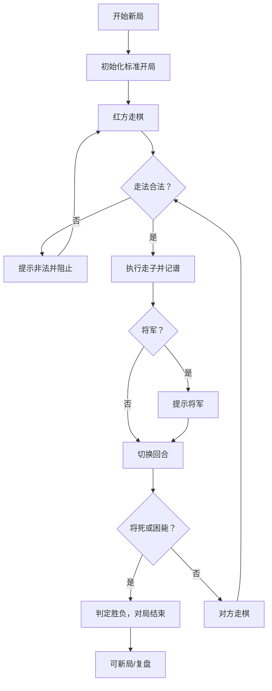

# 中国象棋游戏 PRD（产品需求文档）

## 1. 产品概述

本项目是一款基于 Web 的中国象棋（Xiangqi）对弈游戏，严格遵循《中国象棋竞赛规则》（中国象棋协会审定）的标准走子与判负规则，面向象棋爱好者、学习者及休闲玩家，提供完整的人机/人人本地对弈、记谱、复盘与判局能力。

- **核心目标**：实现一套规则严谨、判局准确、交互流畅的中国象棋引擎与界面，可作为规则学习与对弈训练工具。
- **目标用户**：象棋初学者（学习规则）、进阶爱好者（对弈训练）、普通休闲玩家。
- **市场价值**：以零依赖、纯前端的轻量形态，提供可离线运行、规则权威的象棋体验，便于教学与传播。

## 2. 核心功能

### 2.1 用户角色

本产品为单机本地应用，无账号体系，所有用户共享同一套功能。

| 角色 | 使用方式 | 核心权限 |
|------|----------|----------|
| 对弈者 | 直接打开网页 | 走棋、悔棋、重开、切换视角、查看记谱与判局 |

### 2.2 功能模块

1. **对弈主界面**：棋盘渲染、棋子交互、走子提示、回合状态、计时。
2. **控制面板**：新局、悔棋、重开、切换视角、翻转棋盘、规则速查。
3. **记谱面板**：实时记录双方着法（中文记谱法）、回合数、被吃棋子展示。

### 2.3 页面详情

| 页面名称 | 模块名称 | 功能描述 |
|----------|----------|----------|
| 对弈主界面 | 棋盘区 | 9×10 标准棋盘、楚河汉界、九宫格、棋子落点提示、上一步高亮 |
| 对弈主界面 | 状态栏 | 当前回合方（红/黑）、将军提示、胜负结果、双方计时 |
| 控制面板 | 操作区 | 新局、悔棋、重开、翻转棋盘、切换视角、规则速查弹窗 |
| 记谱面板 | 着法记录 | 中文记谱法着法列表、回合编号、被吃棋子区、滚动定位 |

## 3. 核心流程

### 3.1 对局主流程

红方先行，双方轮流走棋。每步走棋后引擎校验合法性，并更新将军/将死/困毙状态；当一方被将死或困毙时对局结束并判定胜负。玩家可随时悔棋、重开或翻转视角。

### 3.2 流程图

## 4. 用户界面设计

### 4.1 设计风格

- **主色调**：以传统宣纸米黄（#F3E9D2）为棋盘底，朱砂红（#C0392B）为红方，墨黑（#2C2C2C）为黑方，辅以青砖灰（#5D6D7E）边框，营造古典书卷气。
- **棋子风格**：圆形立体棋子，红方朱砂阳刻、黑方墨色阴刻，字体采用书法楷体，带柔和投影与高光。
- **按钮风格**：圆角矩形，主操作（新局）用朱砂实色，次操作（悔棋/翻转）用描边样式。
- **字体**：标题用「霞鹜文楷/楷体」书法风，正文用「思源宋体」衬线体，棋面用楷体。
- **布局风格**：桌面优先三栏布局（左控制面板、中棋盘、右记谱），棋盘居中突出。
- **图标/装饰**：楚河汉界书法字、九宫斜线、落点圆圈提示、上一步金色高亮。

### 4.2 页面设计概览

| 页面名称 | 模块名称 | UI 元素 |
|----------|----------|----------|
| 对弈主界面 | 棋盘区 | 宣纸底纹、楚河汉界、九宫斜线、立体棋子、落点提示、上步高亮 |
| 对弈主界面 | 状态栏 | 回合指示灯、将军红字提示、胜负横幅、双方倒计时 |
| 控制面板 | 操作区 | 新局/悔棋/重开/翻转/规则按钮、视角切换 |
| 记谱面板 | 着法记录 | 回合编号、中文记谱、被吃棋子缩略、自动滚动 |

### 4.3 响应式

- **桌面优先**：三栏布局，棋盘固定大尺寸居中。
- **平板适配**：棋盘居中，控制面板与记谱面板折叠为顶部/底部抽屉。
- **移动端**：单列布局，棋盘自适应宽度，触摸优化（点选棋子→点选落点），按钮增大触控区。

## 5. 规则规格（标准比赛规则）

本游戏严格遵循中国象棋协会审定的标准规则，核心规则如下：

### 5.1 棋盘与棋子

- 棋盘 9 列（纵线）× 10 行（横线），交叉点为落子点，共 90 个点。
- 中间为「楚河汉界」，第 5、6 横线之间无纵线连接（象不过河）。
- 双方各有九宫（3×3 区域，带斜线），帅/将、仕/士活动范围限于此。

### 5.2 各棋子走法

| 棋子 | 红方 | 黑方 | 走法 |
|------|------|------|------|
| 帅/将 | 帅 | 将 | 在九宫内每次走一步，横或竖，不可斜走；不可「飞将」（双将同列且中间无子时，轮到一方可直接吃对方将） |
| 仕/士 | 仕 | 士 | 在九宫内每次沿斜线走一步 |
| 相/象 | 相 | 象 | 走「田」字（斜走两步），不可过河；「田」心有子则「塞象眼」不可走 |
| 马 | 馬 | 馬 | 走「日」字（先直一步再斜一步）；直行方向第一步有子则「蹩马腿」不可走 |
| 车 | 俥 | 車 | 沿横线或纵线直走任意步，遇子则止，可吃对方子 |
| 炮 | 炮 | 砲 | 不吃子时同车走法；吃子时必须翻越恰好一个棋子（炮架） |
| 兵/卒 | 兵 | 卒 | 未过河每步只能向前一步；过河后可向前或左右各一步，不可后退 |

### 5.3 胜负与和棋判定

- **将死**：被将军且无任何合法走法解除将军，则被将死，负。
- **困毙**：轮到走棋的一方无任何合法走法（无论是否被将军），判负。
- **飞将**：双将同列且中间无任何棋子时，视为可被对方将直接「飞」吃，判负。
- **自杀禁止**：任何使己方将被对方直接吃到的走法为非法（送将）。
- **长将禁止**：同一局面下连续将军导致循环，长将方须变着，不变判负。

### 5.4 行棋顺序

- 红方先行，黑方后行，交替进行，直至分出胜负或和棋。

### 5.5 记谱法

采用中文记谱法（如「炮二平五」「马8进7」），红方用汉字数字（一至九，从右至左），黑方用阿拉伯数字（1至9，从左至右），着法分「进/退/平」。
