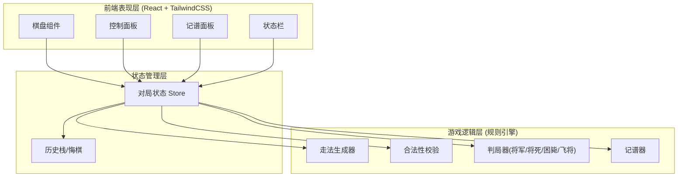

# 中国象棋游戏 技术架构文档

## 1. 架构设计

本项目为纯前端单页应用，无后端服务，所有规则计算与状态管理均在浏览器端完成。架构分为三层：UI 表现层、游戏逻辑层（规则引擎）、状态管理层。



## 2. 技术说明

- **前端框架**：React 18 + TypeScript
- **构建工具**：Vite
- **样式方案**：TailwindCSS 3
- **状态管理**：React useReducer + Context（轻量，无需引入额外状态库）
- **初始化工具**：vite-init（`npm create vite@latest`）
- **后端**：无（纯前端，离线可运行）
- **数据存储**：无持久化数据库；对局状态存于内存，可选 localStorage 存储历史对局

## 3. 目录结构

```
chinese-chess/
├── src/
│   ├── game/                  # 规则引擎（纯逻辑，无 UI 依赖）
│   │   ├── types.ts           # 类型定义（Piece/Color/Move/Board）
│   │   ├── constants.ts       # 棋盘常量、初始局面
│   │   ├── moves.ts           # 各棋子走法生成器
│   │   ├── validate.ts        # 走法合法性校验（含送将/飞将）
│   │   ├── judge.ts           # 将军/将死/困毙判定
│   │   └── notation.ts        # 中文记谱法
│   ├── components/            # UI 组件
│   │   ├── Board.tsx          # 棋盘渲染
│   │   ├── Piece.tsx          # 棋子渲染
│   │   ├── ControlPanel.tsx   # 控制面板
│   │   ├── NotationPanel.tsx  # 记谱面板
│   │   └── StatusBar.tsx      # 状态栏
│   ├── store/                 # 状态管理
│   │   └── gameStore.tsx      # useReducer + Context
│   ├── App.tsx
│   ├── main.tsx
│   └── index.css
├── index.html
├── package.json
├── tsconfig.json
├── vite.config.ts
└── tailwind.config.js
```

## 4. 核心数据模型

### 4.1 类型定义

```typescript
// 颜色
type Color = 'red' | 'black';

// 棋子类型
type PieceType = 'king' | 'advisor' | 'elephant' | 'horse' | 'chariot' | 'cannon' | 'soldier';

// 棋子
interface Piece {
  type: PieceType;
  color: Color;
}

// 坐标：col 0-8（列），row 0-9（行，0 为红方底线，9 为黑方底线）
interface Position {
  col: number;
  row: number;
}

// 走法
interface Move {
  from: Position;
  to: Position;
  piece: Piece;
  captured?: Piece;        // 被吃棋子
  notation: string;        // 中文记谱
}

// 棋盘：10 行 × 9 列二维数组，null 表示空
type Board = (Piece | null)[][];

// 对局状态
interface GameState {
  board: Board;
  turn: Color;             // 当前回合
  history: Move[];         // 走棋历史
  selected: Position | null;
  legalMoves: Position[];  // 选中棋子的合法落点
  status: 'playing' | 'check' | 'redWin' | 'blackWin';
  lastMove: Move | null;
}
```

### 4.2 棋盘坐标系

- 列 `col`：0-8，从红方视角左到右。
- 行 `row`：0-9，0 为红方底线（红帅所在），9 为黑方底线（黑将所在）。
- 楚河汉界位于 row 4 与 row 5 之间。
- 红方九宫：col 3-5, row 0-2；黑方九宫：col 3-5, row 7-9。

## 5. 规则引擎设计

### 5.1 走法生成（moves.ts）

为每种棋子实现 `getMoves(board, pos): Position[]`，返回该位置棋子的所有「伪合法」走法（不考虑送将）：

- **king（帅/将）**：九宫内横竖一步；额外生成「飞将」吃子走法（同列无子时可吃对方将）。
- **advisor（仕/士）**：九宫内斜线一步。
- **elephant（相/象）**：田字两步，不过河，检查象眼。
- **horse（马）**：日字，检查马腿。
- **chariot（车）**：横竖直线滑动，遇子止。
- **cannon（炮）**：不吃子同车；吃子需翻越恰好一子。
- **soldier（兵/卒）**：未过河向前；过河后向前或左右。

### 5.2 合法性校验（validate.ts）

1. 由走法生成器得到伪合法走法。
2. 模拟执行走法，检查执行后己方将是否被对方「直接攻击」（被将军）。
3. 若被将军则该走法非法（送将禁止）。
4. 飞将作为 king 走法的一种直接处理。

### 5.3 判局器（judge.ts）

- `isInCheck(board, color)`：判断 color 方将是否被攻击。
- `hasAnyLegalMove(board, color)`：判断 color 方是否有任意合法走法。
- `getGameStatus(board, turn)`：
  - 若 turn 方被将军且无合法走法 → 对方胜（将死）。
  - 若 turn 方未被将军但无合法走法 → 对方胜（困毙）。
  - 若 turn 方被将军但有合法走法 → `check`。
  - 否则 → `playing`。

### 5.4 记谱器（notation.ts）

实现中文记谱法：

- 红方列号：从右至左为一至九（汉字）；黑方列号：从左至右为 1 至 9（阿拉伯数字）。
- 格式：`<棋子><列号><动作><目标>`，动作为「进/退/平」。
- 进退：纵向移动，目标为前进/后退的步数（车马炮兵）或目标列（士象）。
- 平：横向移动，目标为目标列号。
- 同列同种棋子时加「前/后」区分。

## 6. 状态管理设计

采用 `useReducer` 管理全局对局状态，通过 `Context` 暴露给组件：

- **Actions**：`SELECT`、`MOVE`、`UNDO`、`NEW_GAME`、`FLIP_BOARD`。
- **MOVE**：校验合法性 → 执行走子 → 更新历史 → 计算新状态（将军/胜负）→ 生成记谱。
- **UNDO**：从历史栈回退一步，恢复上一局面。
- **NEW_GAME**：重置为标准初始局面，红方先行。

## 7. 路由定义

| 路由 | 用途 |
|------|------|
| `/` | 对弈主界面（棋盘 + 控制面板 + 记谱面板） |

单页应用，无多路由；规则速查以弹窗形式呈现。

## 8. 关键交互流程

1. **选子**：点击己方棋子 → 高亮该棋子并显示所有合法落点（圆圈提示）。
2. **走子**：点击合法落点 → 执行走子 → 棋子移动动画 → 更新记谱与状态。
3. **换选**：点击另一己方棋子 → 切换选中与合法落点。
4. **取消**：点击空白或非法点 → 取消选中。
5. **悔棋**：点击悔棋 → 回退最近一步。
6. **将军提示**：被将军时状态栏红字提示「将军」。
7. **胜负**：将死/困毙时弹出胜负横幅，可新局。

## 9. 性能与正确性保障

- 规则引擎为纯函数，无副作用，便于单元测试。
- 走法生成与判局分离，确保「送将禁止」「困毙」「飞将」判定准确。
- 棋盘规模小（90 点），走法生成与判局计算量极低，无需复杂优化。
- 通过初始局面与典型杀法局面验证规则正确性。
